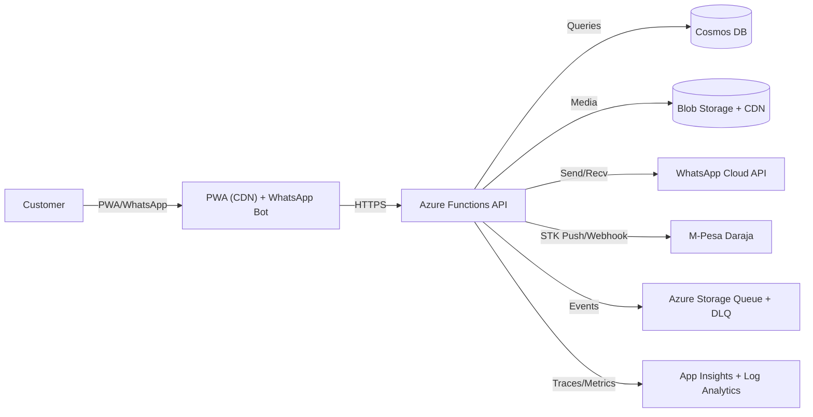

# Architecture Overview

## Context (C4 Level 1)

### Key NFRs
- Latency: STK→Receipt p50 < 8s, p95 < 12s
- Availability: API 99.9% monthly; webhook handling with retries & DLQ
- Scalability: ≥ 50 TPS burst on payment callbacks
- Security: PII-minimal; all secrets in Key Vault; signed buyer links; OTP for merchants

### High-level Data Flow
1. Buyer creates order via PWA or WhatsApp.
2. Merchant triggers STK push; API records payment intent.
3. M-Pesa webhook confirms payment; API marks order PAID.
4. Receipt worker generates PDF, stores in Blob, and sends via WhatsApp/SMS.
